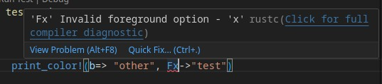

[](https://crates.io/crates/colorize-macros)
[](https://docs.rs/colorize-macros/latest/colorize)


# colorize

A set of Rust macros to assist in turning text into colors for printing on the terminal. 

## Purpose

As I was working with another command line utility, I wanted the ability to convert regular text into ANSI color formatted text more easily, so I wrote a series of macros to help with formatting and/or printing that could be reusable.

## Adding
You can add the macros to your project by using `cargo` or adding `colorize-macros` to your depedencies.

```bash
cargo add colorize-macros
```

```toml
[dependencies]
colorize-macros = "^0.6"
```

## Usage
```rust
use colorize::{print_color, colorize};

// Println "Hello world" in bold green
print_color!(Fgb->"Hello world");

// Returns "Hello" in italic blue and "World" underlined in magenta
let color_string = colorize!(iFb->"Hello", Fmu->"World");
assert_eq!(
    String::from("\x1b[3;34mHello\x1b[0m \x1b[4;35mWorld\x1b[0m"), 
    color_string
);

// Add a format token to multiple inputs using `=>`
// The below example will produce "Hello" with a green foreground, 
// "world" with a blue background, both in bold. 
let color_string = colorize!(b => Fg->"Hello", Bb->"world");
assert_eq!(
    String::from("\x1b[1;32mHello\x1b[0m \x1b[1;44mworld\x1b[0m"),
    color_string
);

// Inputs can be anything that implements the Debug trait
use std::path::PathBuf;

let user_path = PathBuf::from("/home/color/my_new_file.txt");
let pretty_path = colorize!(Fgu->user_path.clone());

assert_eq!(
    String::from("\x1b[32;4m/home/color/my_new_file.txt\x1b[0m"),
    pretty_path
);

print_color!(b => "Moving", Fy->user_path, "to", Fg->PathBuf::from("/home/new_color_dir/my_second_file.txt"));
```

See the [colorize macro](https://docs.rs/colorize-macros/latest/colorize/macro.colorize.html) docs for further style specs.

## New in v.0.7.0 - `proc` feature
The `colorize` macro was re-worked as a `proc macro` to allow for better error handling during the development process. Using the new `colorize` proc macro, you
will see errors during the development process indicating a bad formatting option instead of after you compile/run your code.



To use the new `proc` feature simply add the feature either -
```bash
cargo add colorize-macros --features proc
```

Or add the `proc` feature in your `Cargo.toml`
```toml
[depedencies]
...
colorize-macros = { version = "^0.7.0" features = ["proc"]}
```

No additional changes are needed in your code as the new `proc` version will simply replace the old `colorize` import. This goes for the `print_color` macro as well.

## Development
- [x] Add background color
- [x] Add ability to format multiple arguments with the same input (ie `colorize!(b => "Hello", Fg-> "world")` where "Hello" and "world" are both bold but "world" is the only word that's green)
- [ ] Integrate a color set of log macros from the [log](https://docs.rs/log/latest/log/) crate

## Special Thanks
This crate was originally inspired by the [row](https://github.com/phsym/prettytable-rs/blob/master/src/row.rs) macro in [prettytable](https://github.com/phsym/prettytable-rs).